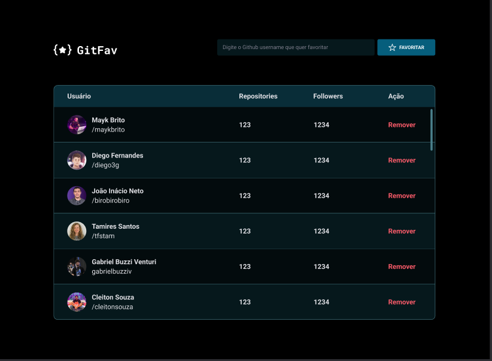

<h1 align="center"> GIT FAV </h1>

 

  

## 🚀 Tecnologias

Esse projeto foi desenvolvido com as seguintes tecnologias:

- HTML e CSS
- JavaScript
- Git e Github
- Figma

## 💻 Projeto

O GitFav é um app para favoritar e rastrear os usuários do github usando a API.

- [Acesse o projeto finalizado, online](https://hgdnz.github.io/gitfav2/)

## 🔖 Layout

Você pode visualizar o layout do projeto através [DESSE LINK](https://efficient-sloth-d85.notion.site/GitFav-f8ff1c18b23745c0b46cd8d61f74b596). É necessário ter conta no [Figma](https://figma.com) para acessá-lo.

## :memo: Licença

Esse projeto está sob a licença MIT.

---

Feito com ♥ by Hugo Diniz and Rocketseat :wave: [Participe da nossa comunidade!](https://discord.gg/rocketseat)
